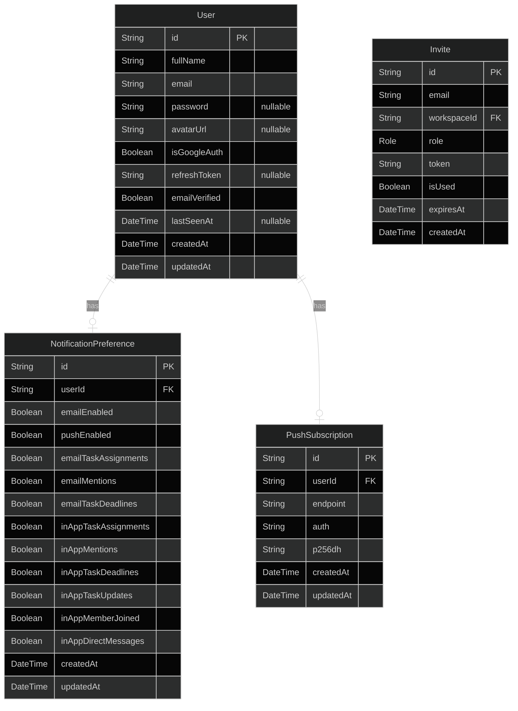
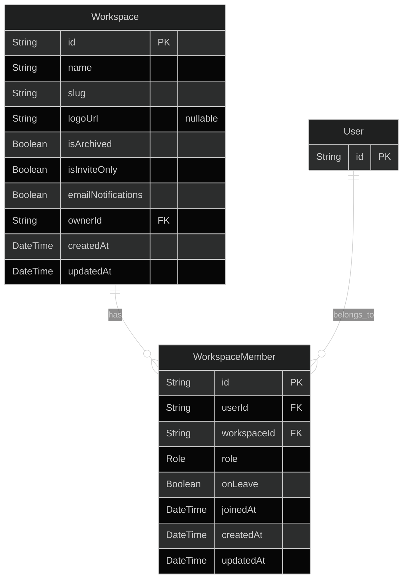
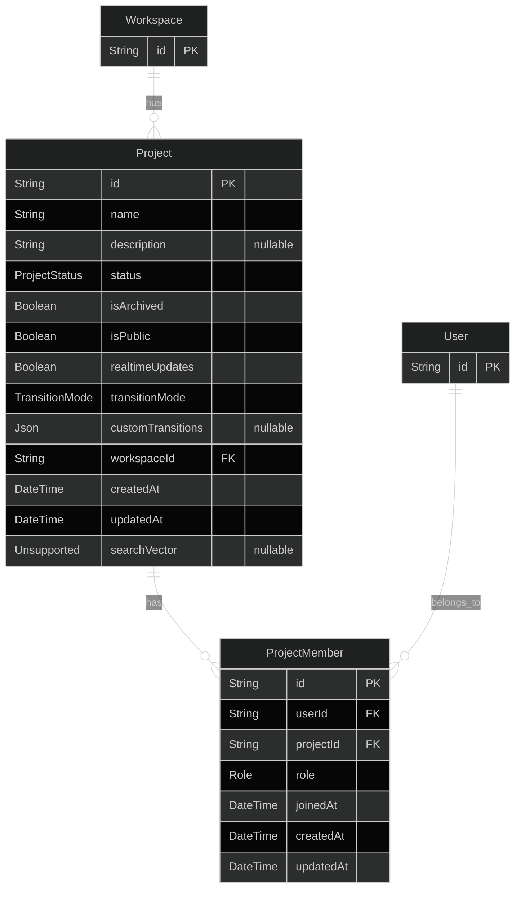
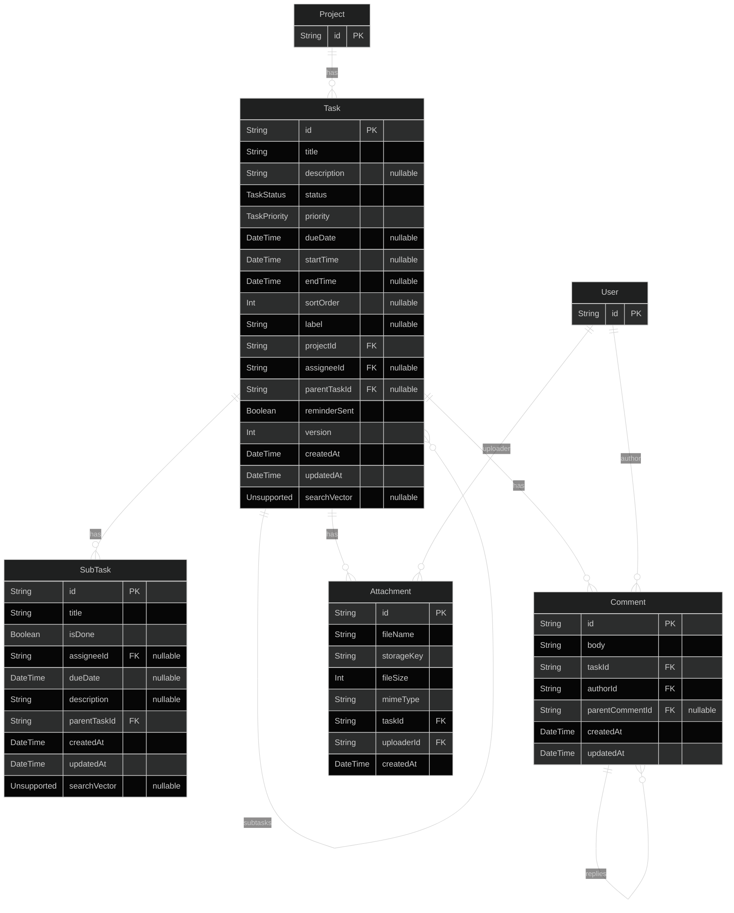
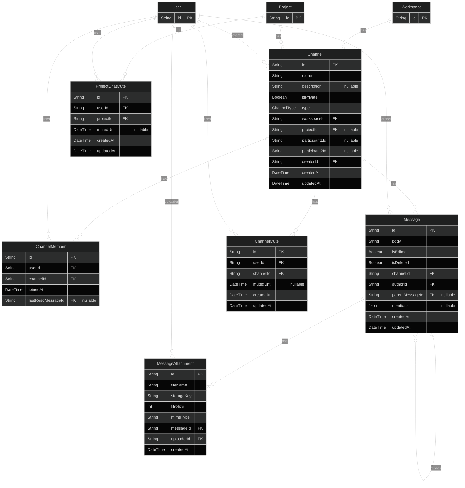
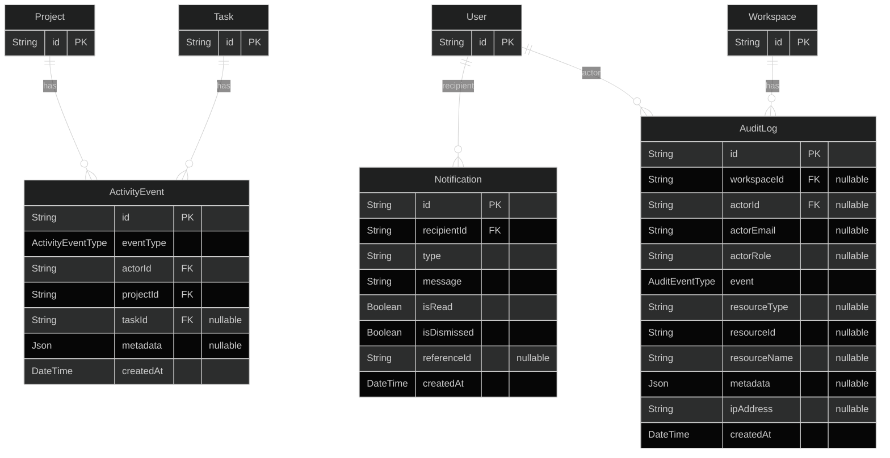

# Entity Relationship Diagrams

The database schema is split into seven domain-specific diagrams for clarity. 
All diagrams use Mermaid `%%{init: {'theme': 'dark'}}%%
erDiagram` syntax. Primary keys are marked `PK`, 
foreign keys are marked `FK`, and nullable fields are marked with a `?` suffix.

## Domain 1 — Auth & Users

## Domain 2 — Workspace & Members

## Domain 3 — Projects & Members

## Domain 4 — Tasks

## Domain 5 — Chat

## Domain 7 — System

