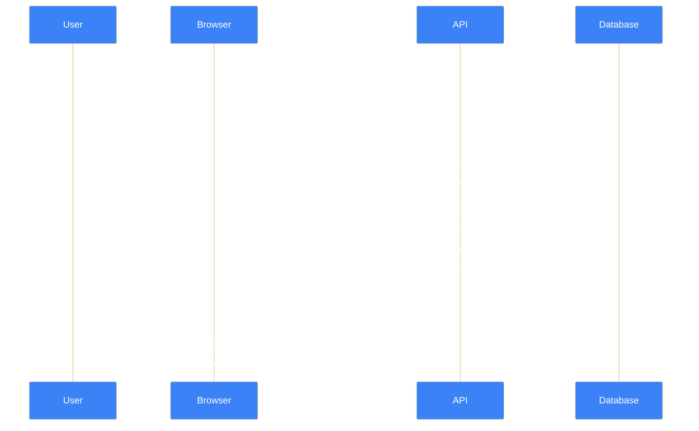
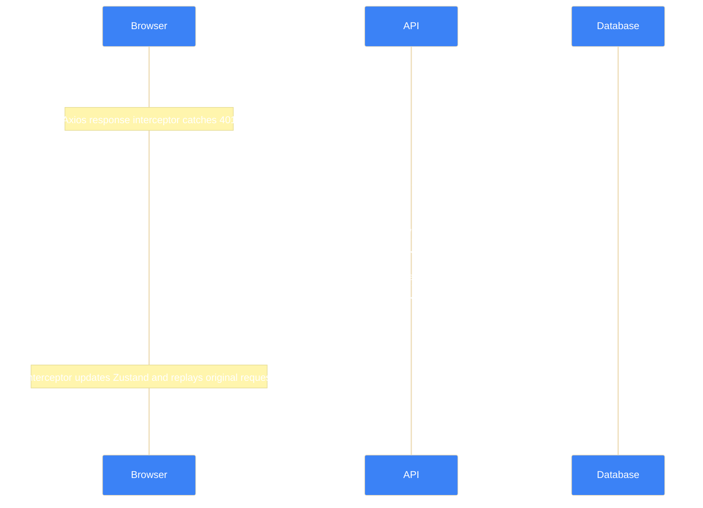
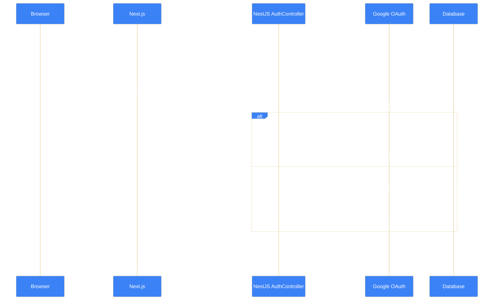
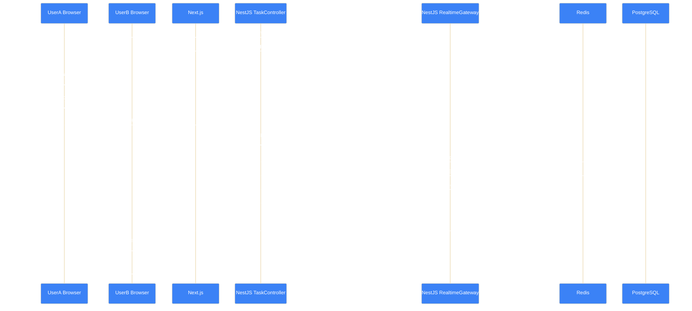
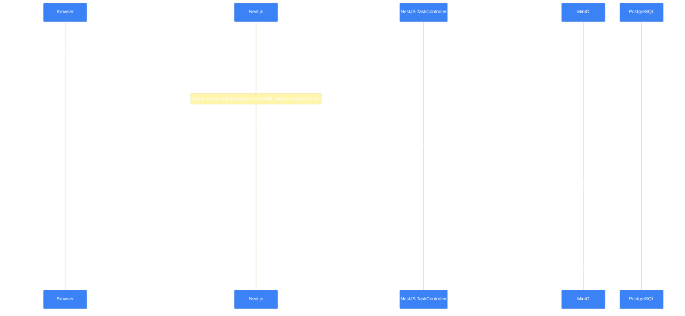

# Sequence Diagrams

Four major workflows documented as step-by-step sequence diagrams.
All diagrams use Mermaid `sequenceDiagram` syntax.

## Login + Token Refresh Flow

### Token Generation Flow (Login)

### Token Refresh Flow (Axios interceptor)

### Google OAuth Flow

## Real-Time Task Update via Socket.IO

## File Upload to MinIO

