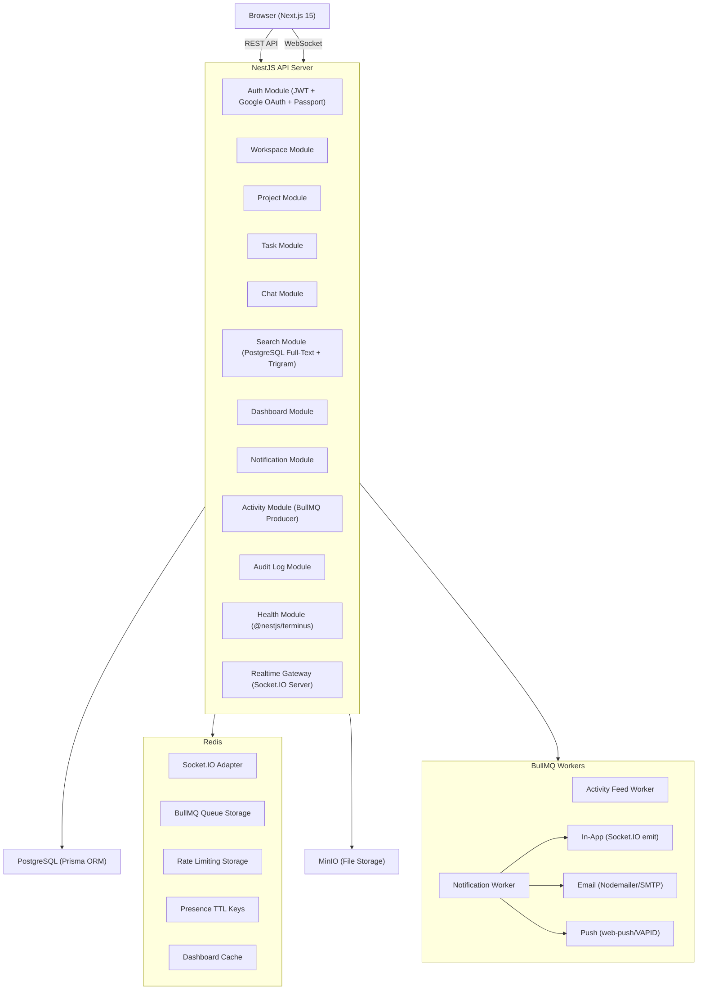
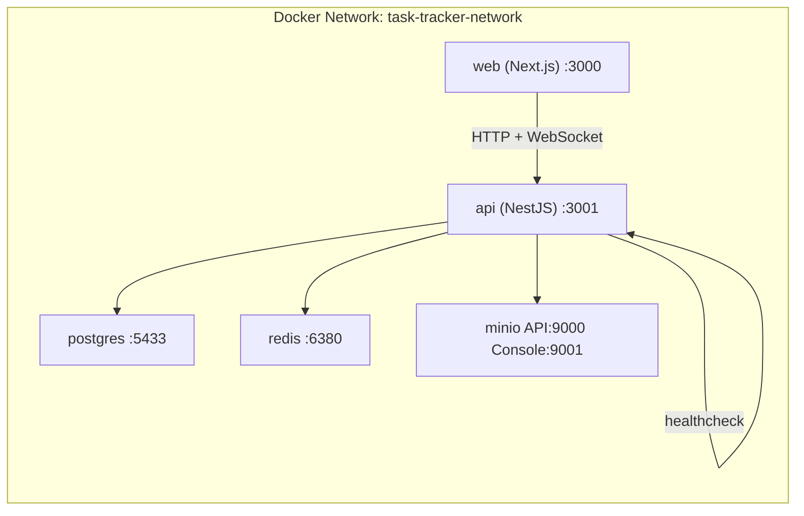

# System Architecture

A full-stack view of the Task Tracker platform showing all components, 
their communication patterns, and how they are containerized in Docker.

## Component Architecture

## Docker Container Architecture

## Real-Time Event Flow

```mermaid
graph LR

    classDef frontend fill:#3b82f6,stroke:#1d4ed8,color:#fff
    classDef backend fill:#8b5cf6,stroke:#6d28d9,color:#fff
    classDef database fill:#10b981,stroke:#059669,color:#fff
    classDef queue fill:#f59e0b,stroke:#d97706,color:#fff
    classDef cache fill:#ef4444,stroke:#dc2626,color:#fff
    classDef storage fill:#6b7280,stroke:#4b5563,color:#fff

    class Browser,Web frontend
    class API,Auth,Workspace,Project,Task,Chat,Search,Dashboard,Notification,Activity,AuditLog,Health,Gateway,Api,Nest backend
    class PostgreSQL,Pg,DbWrite database
    class Redis,SocketAdapter,RateLimit,Presence,Cache cache
    class BullStorage,BullMQWorkers,ActivityWorker,NotifWorker,Queue queue
    class MinIO,Minio storage
    Action["User Action (e.g. drag task to new column)"]
    ZustandOpt["Frontend optimistic update (Zustand store)"]
    Rest["REST API call (PATCH /tasks/:id)"]
    Nest["NestJS Task Service"]
    DbWrite["Prisma write to PostgreSQL"]
    Queue["Activity Queue (BullMQ)"]
    Emit["RealtimeGateway.emitToProject()"]
    PubSub["Redis pub/sub (Socket.IO adapter)"]
    Clients["All connected clients in project room"]
    ZustandSync["Each client's Zustand store updated"]
    Render["UI re-renders"]
    
    Action --> ZustandOpt
    ZustandOpt --> Rest
    Rest --> Nest
    Nest --> DbWrite
    DbWrite --> Queue
    Queue --> Emit
    Emit --> PubSub
    PubSub --> Clients
    Clients --> ZustandSync
    ZustandSync --> Render
```

